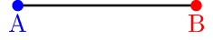
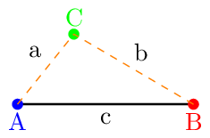
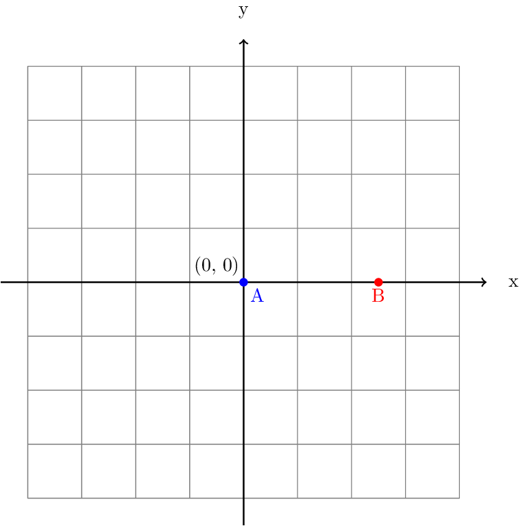
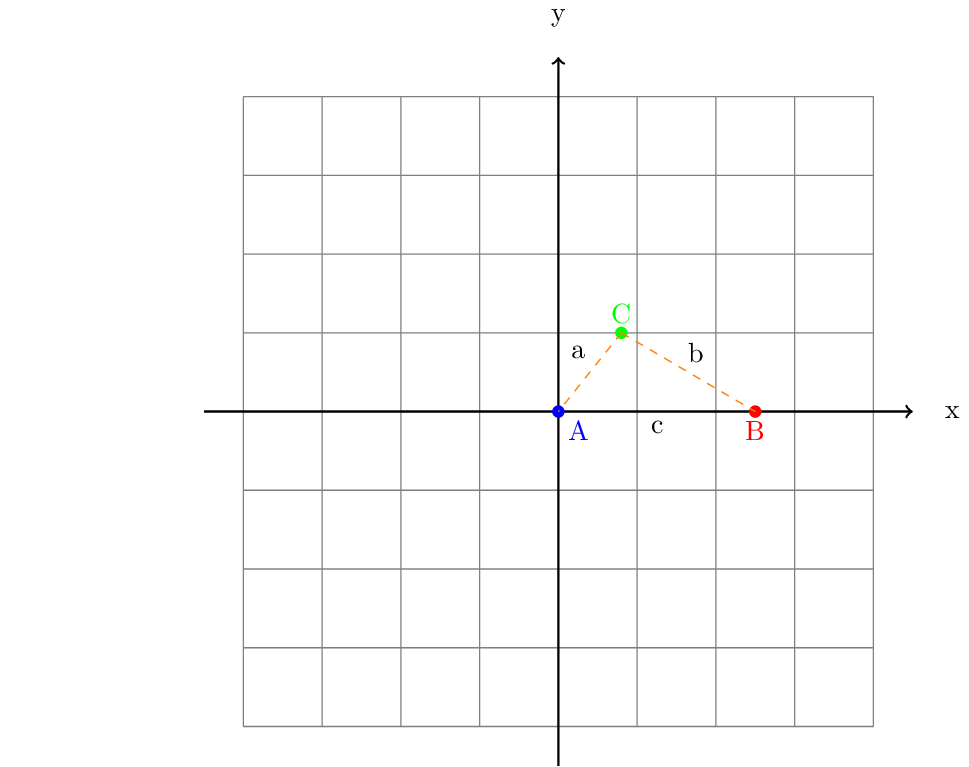
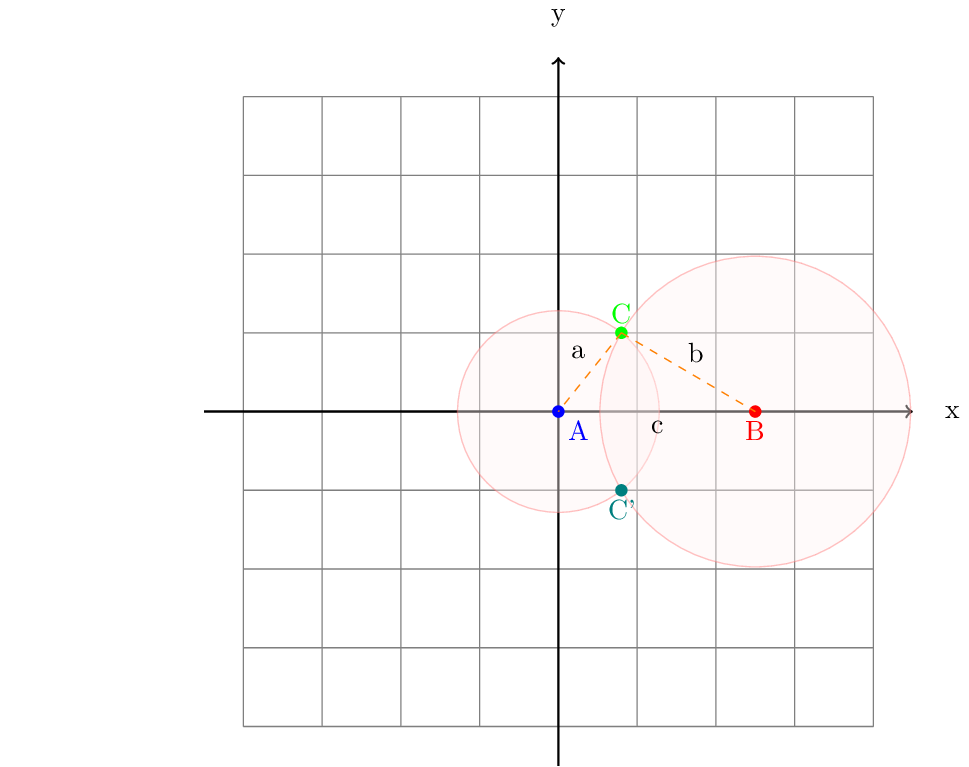

Plug-in for QGIS3.x to create points by trilatering from a baseline. Detailed documentation to follow...

<h1>Principle</h1>

Trilateration starts from a <i>baseline</i>, i.e., a line formed by two known points A and B. The coordinates for these points have established, e.g., by GPS readings.

In surveys, such as archaeological surveys, one may not always be able to use GPS to record more than these points (A and B), but rather has to use a tape measure to record distances from the base line. One method is called <i>offset method</i>, the other <i>trilateration</i>. For this, the coordinates for a point C is computed from its distances from points A and B:

<h1>Algorithm</h1>

To establish point C, we need to move the baseline to coincide with the x axis; this is called <i>translation</i> in linear algebra.

From this constellation, one can compute point C using Pythagoras Theorem:

When we do trilateration by hand, one would use a compass using the distances measured from A and B, and then infer point C by using the intersection point of the circles drawn:

Note that this yields two points: C and C', because there are two intersections. One needs to record which side of the baseline the measurements were taken. The computational approach is exactly the same. Point C is computed by using Pythagoras Theorem, using the distances from A and B as the length for the sides a and b of the triangle.

The point C can then be computed as such (The subscript x and y denoting the x and y components of a point):

$a^{2}~=~C_{x}^{2} + C_{y}^{2}$,  and

$b^{2}~=~(B_{x} - C_{x})^{2} + C_{y}^{2}$

From this, we can derive:

$C_{x} = \frac{a^{2} - b^{2} + B_{x}^{2}}{2B_{x}}$,  and

$C_{y}, C'_{y} = \pm\sqrt{a^{2} - C_{x}^{2}}$

Finally, the points A, B, and C need to be translated back to where they were. The whole algorithm thus is:

<ol>
   <li>Translate point A so that it lies at the origin.</li>
   <li>Translate point B by the same distance; rotate the translated B around the origin so that it lies on the x axis. (To find the angle between a point [x,y] and the x axis: $\theta = \arctan(\frac{y}{x})$).</li>
   <li>Compute C by using the formulas above.</li>
   <li>Rotate back point C by the same angle as B was, i.e., by $-\theta$.</li>
   <li>Translate C by the same amount that point A was, see point 1.</li>
</ol>