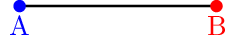
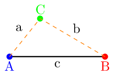
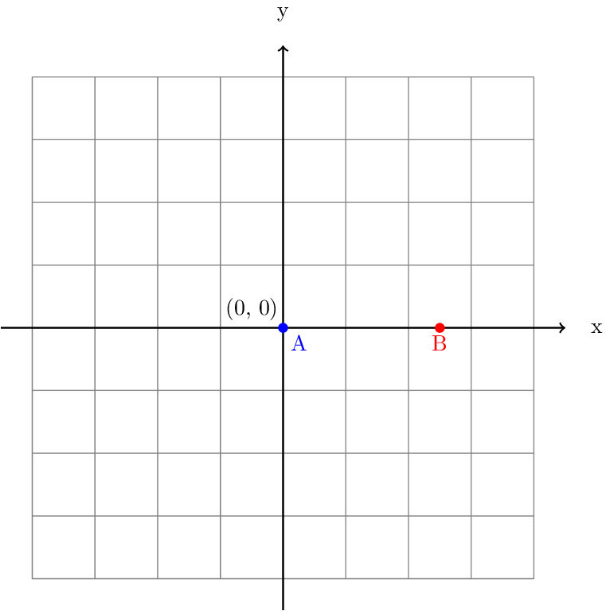
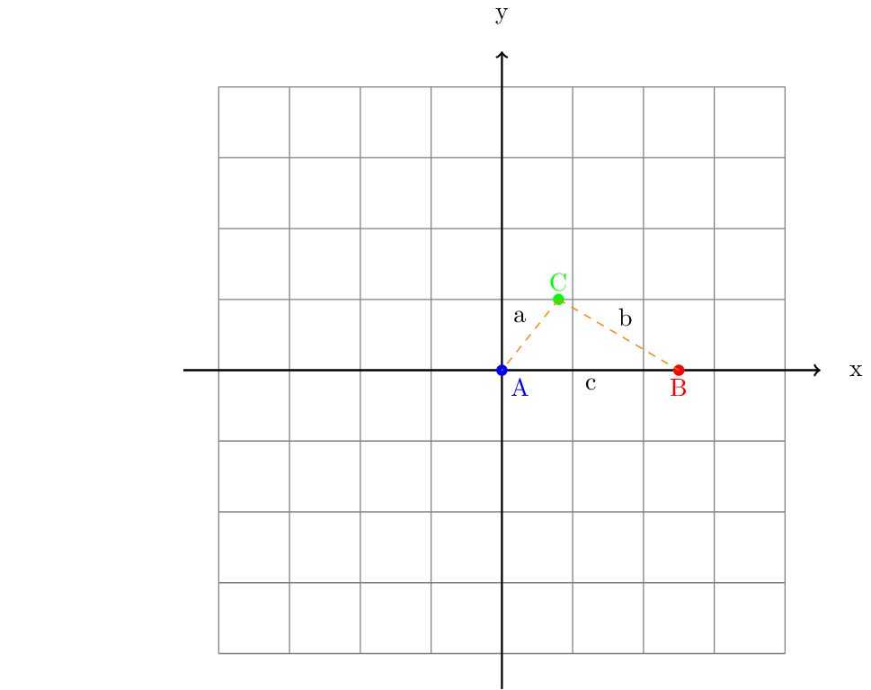
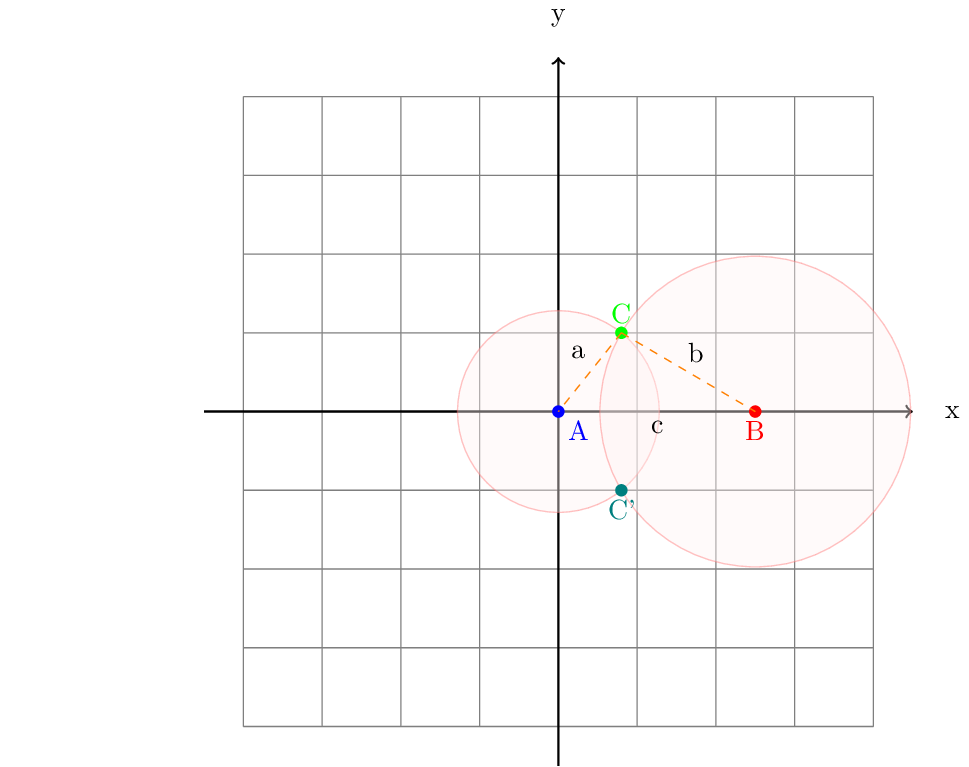
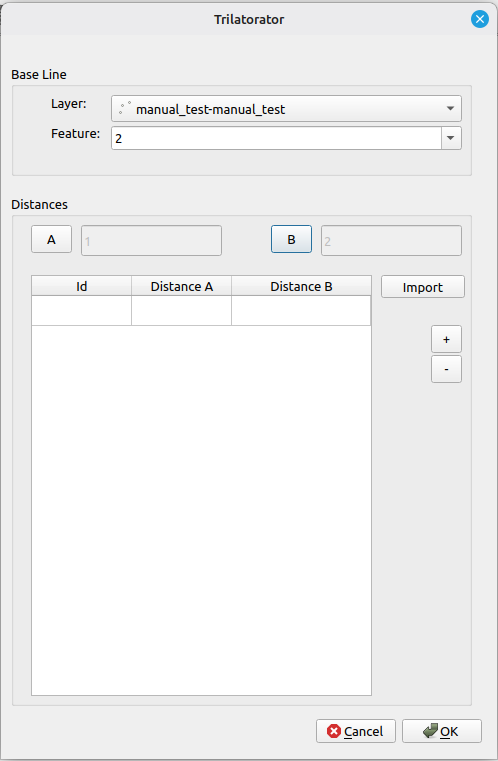

Plug-in for QGIS3.x to create points by trilatering from a baseline.

<h1>Principle</h1>

Trilateration starts from a <i>baseline</i>, i.e., a line formed by two known points A and B. The coordinates for these points have established, e.g., by GPS readings.

In surveys, such as archaeological surveys, one may not always be able to use GPS to record more than these points (A and B), but rather has to use a tape measure to record distances from the base line. One method is called <i>offset method</i>, the other <i>trilateration</i>. For the latter, the coordinates for a point C is computed from its distances from points A and B:

<h1>Algorithm</h1>

To establish point C, we need to move the baseline to coincide with the x axis; this is called <i>translation</i> in linear algebra.

From this constellation, one can compute point C using Pythagoras Theorem:

When we do trilateration by hand, one would use a compass using the distances measured from A and B, and then infer point C by using the intersection point of the circles drawn:

Note that this yields two points: C and C', because there are two intersections. One needs to record which side of the baseline the measurements were taken. The computational approach is exactly the same. Point C is computed by using Pythagoras Theorem, using the distances from A and B as the length for the sides a and b of the triangle.

The point C can then be computed as such (The subscript x and y denoting the x and y components of a point):

$a^{2}~=~C_{x}^{2} + C_{y}^{2}$,  and

$b^{2}~=~(B_{x} - C_{x})^{2} + C_{y}^{2}$

From this, we can derive:

$C_{x} = \frac{a^{2} - b^{2} + B_{x}^{2}}{2B_{x}}$,  and

$C_{y}, C'_{y} = \pm\sqrt{a^{2} - C_{x}^{2}}$

Finally, the points A, B, and C need to be translated back to where they were. The whole algorithm thus is:

<ol>
   <li>Translate point A so that it lies at the origin.</li>
   <li>Translate point B by the same distance; rotate the translated B around the origin so that it lies on the x axis. (To find the angle between a vector [x,y] and the x axis: $\theta = \arctan ( \frac{y}{x} ) $).</li>
   <li>Compute C by using the formulas above.</li>
   <li>Rotate back point C by the same angle as B was, i.e., by $-\theta$.</li>
   <li>Translate C by the same amount that point A was, see point 1.</li>
</ol>

<h2>Usage</h2>

The use is quite straight-forward as well (I hope). Upon launching the plug-in, a GUI window will pop up:

Under &ldquo;Layer&rdquo; you have to select the layer from which you select the points forming the base layer. The dropdown box should only show projected points layers. In the dropdown menu below, &ldquo;Feature&rdquo;, you select a point from the layer, by the id of the point. Once selected, you have to press either the &ldquo;A&rdquo; or the &ldquo;B&rdquo; buttons to select start point and end point, respectively, of the baseline. The same point cannot be used for both start point and end point. The order does not matter per se, but keep in mind that the position is computed from the distances from each point.

Below is then a table with the survey values; the colum <i>Id</i> is an identifier that you can assign yourself, the colum <i>Distance A</i> is the distance from point A on the baseline in metres to the measured point (the $a$ in figure 2); ditto for column <i>Distance B</i>, which represent line $b$ in figure 2. If you want to enter these values manually, simply click into the cell and enter them; the &ldquo;+&rdquo; and  &ldquo;-&rdquo; buttons on the right allow you to add or remove lines from the table. The button &ldquo;Import&rdquo; allows you to import the values from a CSV file. The file should contain only the three columns in the same order as in the table, with no colum header. Distances should be in the same unit as the points layer for <i>A</i> and <i>B</i>, usually metres.

Please note that this plug-in is still being tested, and likely contains bugs. Patience (and feedback) is appreciated. The software is provided &ldquo;as is&rdquo; and released under Apache 2.0 license.
